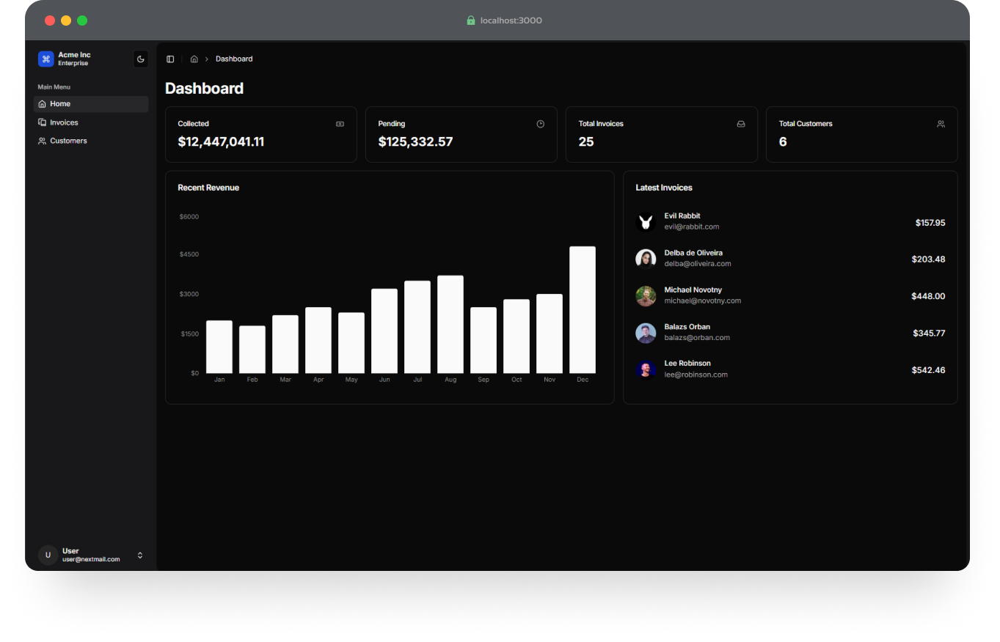

# Next.js Admin Dashboard with Prisma and shadcn/ui

This repository is a project built following the [Next.js tutorial](https://nextjs.org/learn) with added integration of [Prisma](https://www.prisma.io/), a next-generation ORM for seamless database interaction. Additionally, this project incorporates [shadcn/ui](https://shadcn.dev/) for reusable and beautifully designed UI components.

## Demo

You can try a live demo of this dashboard here:

[**Demo Site**](https://nextjs-dashboard-drab-seven-30.vercel.app/)

**Demo Login Credentials**

- **Username**: `user@nextmail.com`
- **Password**: `123456`

> **Note**: The demo site may have limited functionality or reset periodically.

### Preview



## Overview

This application is built using [Next.js](https://nextjs.org/), a React framework that enables server-side rendering, static site generation, and more. Prisma has been integrated to simplify data management and provide a strong type-safe connection to the database.

## Features

- **Next.js**: Framework for creating performant and scalable React applications with a focus on server-rendering and static exports.
- **Prisma**: Used as the ORM for database management, providing a smooth way to interact with the database in a type-safe manner.
- **shadcn/ui**: Integrated for building elegant, reusable components with consistent styling.

## Getting Started

### Prerequisites

- Node.js v14 or later
- `pnpm` package manager
- A database supported by Prisma (e.g., PostgreSQL, MySQL, SQLite, etc.)

### Installation

1. **Clone the repository**:

   ```bash
   git clone https://github.com/ebulku/nextjs-dashboard.git
   cd nextjs-dashboard
   ```

2. **Install dependencies**:

   ```bash
   pnpm install
   ```

3. **Configure Prisma**:

   Copy `.env.example` to `.env` and fill your database connection:
   (For more details, see this step guide in the [Next.js Tutorial](https://nextjs.org/learn/dashboard-app/setting-up-your-database#create-a-postgres-database))

   ```plaintext
    POSTGRES_URL=
    POSTGRES_PRISMA_URL=
    POSTGRES_URL_NON_POOLING=
    POSTGRES_USER=
    POSTGRES_HOST=
    POSTGRES_PASSWORD=
    POSTGRES_DATABASE=

    # `openssl rand -base64 32`
    AUTH_SECRET=
   ```

4. **Run Prisma migrations**:

   ```bash
   npx prisma migrate dev --name init
   ```

5. **Generate Prisma client**:

   ```bash
   npx prisma generate
   ```

6. **Start the Next.js development server**:
   ```bash
   pnpm dev
   ```

### Project Structure

- `app/`: Contains the main pages for the Next.js application.
- `prisma/`: Contains Prisma schema and migration files.
- `components/`: Contains reusable components implemented with shadcn/ui.

### Usage

To develop or test the app locally, you can start the development server with:

```bash
pnpm dev
```

The app should be available at `http://localhost:3000`.

## Prisma Integration

Prisma is used in this project to handle data interactions. Here’s a quick overview of commands to manage the database with Prisma:

- **Run migrations**:

  ```bash
  npx prisma migrate dev
  ```

- **Generate Prisma client**:

  ```bash
  npx prisma generate
  ```

- **Open Prisma Studio** (a web-based interface for interacting with your database):
  ```bash
  npx prisma studio
  ```

## Contributing

Contributions are welcome! Please submit an issue or pull request if you have suggestions or improvements.

## License

This project is licensed under the MIT License.
